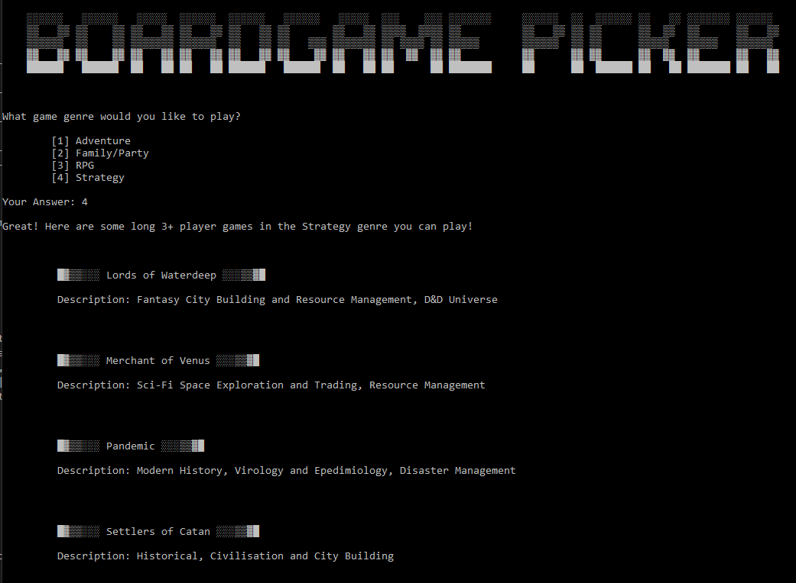

## Boardgame Picker
CCC-2021 T1A3 - Terminal Application - Karl Alberto

# Application Testing

## Feature Testing

Overview of the main testing methodology applied for the following features:

| Feature           | Testing Process                                                                                   | Expected Result                                                                             | Bugs/Issues Found                                                        | Date Encountered | Solution/Developer Notes                                                                                                      | Date Fixed |
| ----------------- | ------------------------------------------------------------------------------------------------- | ------------------------------------------------------------------------------------------- | ------------------------------------------------------------------------ | ---------------- | ----------------------------------------------------------------------------------------------------------------------------- | ---------- |
| Multiple Choice   | Run program per user instructions                                                                 | Program displays game recommendations as per development plan                               | No issues encountered                                                    | N/A              | Working as expected                                                                                                           | N/A        |
|                   | Iterate through each set of options and combinations between: player numbers, duration, and genre | Program displays game recommendations, showing different game suggestions at end of program | Bug: 'Light Strategy' genre results also displaying in 'Strategy' genre | 17/07/2021       | 'filteredGames' variable now looks for exact match for genre                                                                   | 17/07/2021 |
|                   | Exit program at end                                                                               | Program quits when 'n' is entered                                                           | No issues encountered                                                    | N/A              | Working as expected; no issues with letter case variation                                                                     | N/A        |
|                   |                                                                                                   |                                                                                             |                                                                          |                  |                                                                                                                               |            |
| Restart/Exit/Quit | Run program and choose to restart at end                                                          | Restarts at question 1 when user enters 'y'                                                 | No issues encountered                                                    | N/A              | Working as expected; no issues with letter case variation                                                                     | N/A        |
|                   | Run program and choose to 'quit' at each question                                                 | Program quits when user enters 'q' or 'quit'                                                | No issues encountered                                                    |                  | Working as expected; no issues with letter case variation. Tested 2 times per question, where 'q' and 'quit' were each tested | N/A        |
|                   |                                                                                                   |                                                                                             |                                                                          |                  |                                                                                                                               |            |
| Error Handling    | Run program and enter incorrect string or characters at each question                             | ValueError message triggers, user is asked to enter selectable answer from options given    | No issues encountered                                                    | N/A              | Working as expected                                                                                                           | N/A        |

## Individual Feature Test Results

### Multiple Choice Tests

Spreadsheet of each answer iteration run:

| Run | Testing Process                                             | Expected Result            | Answer Iteration | Bugs/Issues Found                                                       |
| --- | ----------------------------------------------------------- | -------------------------- | ---------------- | ----------------------------------------------------------------------- |
| 1   | Run program starting from 'One Player' selection            | Generates game suggestions | 1,1,1            | No issues encountered                                                   |
| 2   |                                                             |                            | 1,1,2            | No issues encountered                                                   |
| 3   |                                                             |                            | 1,1,3            | No issues encountered                                                   |
| 4   |                                                             |                            | 1,2,1            | No issues encountered                                                   |
| 5   |                                                             |                            | 1,2,2            | No issues encountered                                                   |
| 6   |                                                             |                            | 1,2,3            | No issues encountered                                                   |
| 7   | Run program starting from 'Two Player' selection            | Generates game suggestions | 2,1,1            | No issues encountered                                                   |
| 8   |                                                             |                            | 2,1,2            | No issues encountered                                                   |
| 9   |                                                             |                            | 2,1,3            | No issues encountered                                                   |
| 10  |                                                             |                            | 2,1,4            | No issues encountered                                                   |
| 11  |                                                             |                            | 2,1,5            | Bug: 'Light Strategy' genre results also displaying in 'Strategy' genre |
| 12  |                                                             |                            | 2,2,1            | No issues encountered                                                   |
| 13  |                                                             |                            | 2,2,2            | No issues encountered                                                   |
| 14  |                                                             |                            | 2,2,3            | No issues encountered                                                   |
| 15  |                                                             |                            | 2,2,4            | No issues encountered                                                   |
| 16  | Run program starting from 'Three or more Players' selection | Generates game suggestions | 3,1,1            | No issues encountered                                                   |
| 17  |                                                             |                            | 3,1,2            | No issues encountered                                                   |
| 18  |                                                             |                            | 3,1,3            | No issues encountered                                                   |
| 19  |                                                             |                            | 3,2,1            | No issues encountered                                                   |
| 20  |                                                             |                            | 3,2,2            | No issues encountered                                                   |
| 21  |                                                             |                            | 3,2,3            | No issues encountered                                                   |
| 22  |                                                             |                            | 3,2,4            | No issues encountered                                                   |

### User 'Quit' Tests

Spreadsheet of each iteration of user quitting:

| Run        | Testing Process                                            | Expected Result | Number of Iterations Run | Bugs/Issues Found     |
| ---------- | ---------------------------------------------------------- | --------------- | ------------------------ | --------------------- |
| Quit at Q1 | Run program and 'quit' at Q1                               | Quits program   | 4                        | No issues encountered |
| Q at Q1    | Run program and 'q' at Q1                                  | Quits program   | 4                        | No issues encountered |
| Quit at Q2 | Run program, select option at Q1, then 'quit' at Q2        | Quits program   | 4                        | No issues encountered |
| Q at Q2    | Run program, select option at Q1, then 'q' at Q2           | Quits program   | 4                        | No issues encountered |
| Quit at Q3 | Run program, select option at Q1 and Q2, then 'quit' at Q3 | Quits program   | 4                        | No issues encountered |
| Q at Q3    | Run program, select option at Q1 and Q2, then 'q' at Q3    | Quits program   | 4                        | No issues encountered |
|            |                                                            |                 |                          |                       |
| qUit       | Run program, enter term at each question interval          | Quits program   | 3                        | No issues encountered |
| QuIT       | Run program, enter term at each question interval          | Quits program   | 3                        | No issues encountered |
| quiT       | Run program, enter term at each question interval          | Quits program   | 3                        | No issues encountered |
| QUIT       | Run program, enter term at each question interval          | Quits program   | 3                        | No issues encountered |
| QUIt       | Run program, enter term at each question interval          | Quits program   | 3                        | No issues encountered |

## Developer Notes

Spreadsheets can be found here: [T1A3 - Application Testing](https://docs.google.com/spreadsheets/d/1MtP1JEIxziC8FzLlZQdMe6uaXkr8M-RvtGlvbbMq3Fk/edit?usp=sharing)