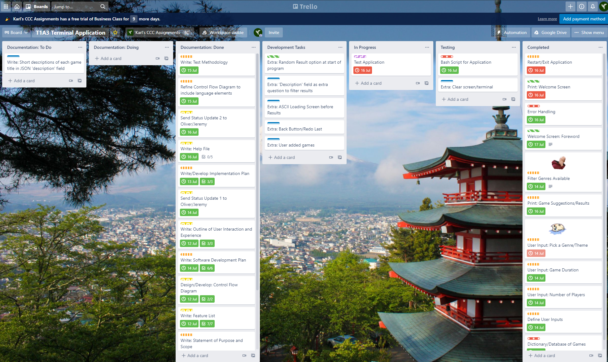
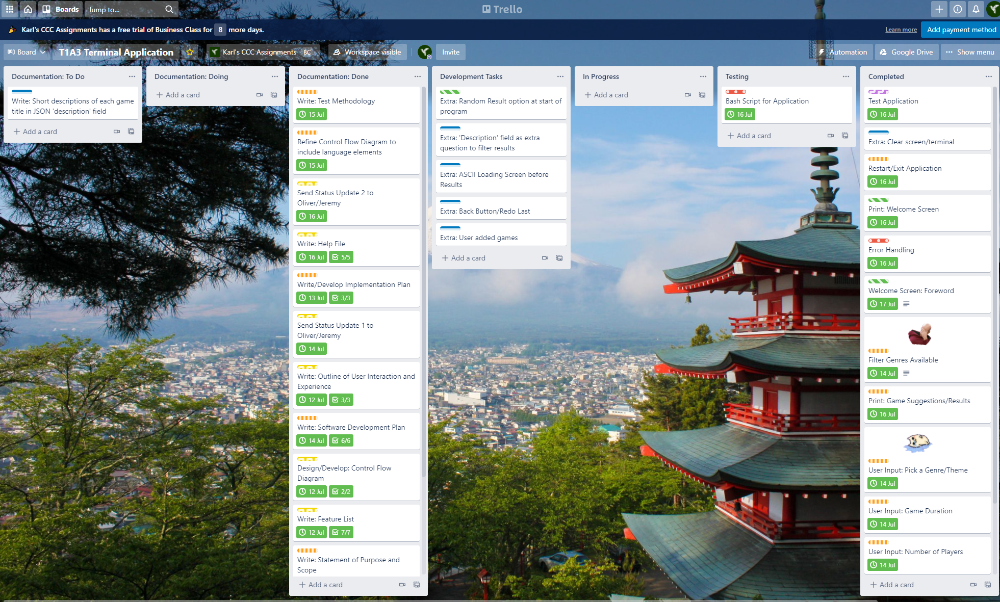

## Boardgame Picker
CCC-2021 T1A3 - Terminal Application - Karl Alberto

# Development Log

## Update 3
### Saturday, 17 July 2021

#### **Key Development Items**

* CLI/Clear Terminal functions added to app!
* Testing complete (minus testing clear terminal).
* Fixed genre issue (problem detailed below) where 'genre' clash appeared.
    * Fixed 'getGameRecs' function, so that 'filteredGames' variable looked for an exact match for genre.
* Basic bash script created.

#### **Issues Encountered**

* Had to remove user input display to facilitate the clear terminal function. (This used to be displayed after each question was answered by the user, leading into the following question)
* Bug found: issue with 'genre' field found during testing: 'Light Strategy' genre gets picked up in the 'Strategy' genre as well. Problem not present with 'Grand Strategy', as that genre currently only exists in "2-player, long game" situations.

#### **Development Roadblocks**

* Still working on bash script/wrapper.

#### **Miscellaneous Notes**

* Minor flavour text edits.

#### Trello Updates

---

## Update 2
### Friday, 16 July 2021

#### **Key Development Items**

* Completed minimum viable product.
* Finished work on welcome screen.
* Added ASCII art on welcome screen.
* Finished work on 'Restart' option.
* Began testing program.
* Wrote Help file.

#### **Key Learnings**

* Used `filter` and `map` functions to call items within the dataset.
* Used `lambda` functions to specify values to retrieve.
* Dataset items had to be converted using different methods to output, filter, then display the correct items. To get 'genre' values to display:
    * First had to filter data, using lambda and map functions, converting to `list`;
    * Removed duplicates by converting list to `set`;
    * Converted set back to list, so that it was ordered; then sorted;
    * Used `for` loop to convert index values '+1' to display the user selectable genre options (i.e. from ['0', '1', '2'] into '[1] [2] [3]');
    * User input for genre choice `return` as '-1' so it references the correct index item in the list.

#### **Issues Encountered**

* Lots of tinkering with for loops to ensure infinite loops weren't encountered, and correct data was captured and output.

#### **Development Roadblocks**

* Testing application updated to Urgent Priority.
* Still need to work on bash script, updated to Critical Priority.

#### **Miscellaneous Notes**

* Almost there. Finish strong!

---

## Update 1
### Wednesday, 14 July 2021

#### **Key Development Items**

* JSON file updated with list of all games to be included in application.
* Defined packages to import and key functions.
* Implemented user input function to capture number of players.

#### **Issues Encountered**

* Function caused an infinite loop due to indent error.

#### **Development Roadblocks**

* Working to resolve output data (final game recommendations) to make it cleaner, clearer and easier for users to read.
* Work out how to set a filtered set of options to be displayed to the user, when other options need to be excluded (i.e. if no "short" games in the "RPG" genre exist, do not display "RPG" as a selectable option).

#### **Miscellaneous Notes**

* Functions for user input use the following:
    * `while` loop; 
    * `if/else`; and
    * `try/except` blocks for error handling
* Defined variables within functions to ensure code was "dry", especially for repeated error messages.

---
