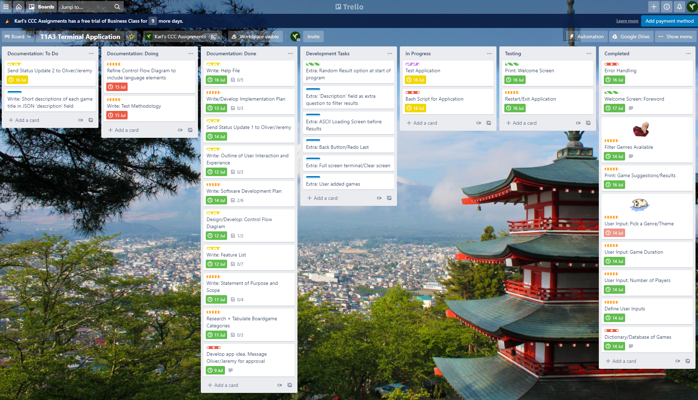

# Boardgame Picker
CCC-2021 T1A3 - Terminal Application - Karl Alberto

# Implementation Plan

## Main Features

Features that are core to the application and **must** run.

| Feature                                   | Implementation Checklist                                                                                             | Priority | Deadline   |
| ----------------------------------------- | -------------------------------------------------------------------------------------------------------------------- | -------- | ---------- |
| Branching Paths and Multiple Choice       | Give users ability to view selectable options                                                                        | High     | 14/07/2021 |
|                                           | First two inputs to determine selectable genres                                                                      | High     | 14/07/2021 |
|                                           | Convert input to integer in first two questions (use to call value in dataset)                                       | High     | 15/07/2021 |
|                                           | Output should only display games with the parameters given by the user (i.e. number of players, duration, and genre) | High     | 15/07/2021 |
|                                           | Error Handling - `try/except` block fails gracefully + displays error message?                                          | High     | 15/07/2021 |
|                                           | Error Handling - `if/elif/else` shows error message for ValueErrors?                                               | Medium   | 15/07/2021 |
|                                           |                                                                                                                      |          |            |
| Output Recommendations with extra details | Given previous features; output displays games, along with a short 'Description' from the dataset                   | Medium   | 16/07/2021 |
|                                           |                                                                                                                      |          |            |
| Dataset                                   | Ensure format can contain individual objects                                                                         | High     | 14/07/2021 |
|                                           | Populate with game entries                                                                                           | High     | 14/07/2021 |
|                                           | Ensure keys and values make semantic sense, and are easy to parse for humans                                         | Medium   | 14/07/2021 |
|                                           |                                                                                                                      |          |            |
| Restart/Exit App                          | Ask user if they want to start the program again from the first question                                             | Medium   | 17/07/2021 |
|                                           | Program triggers `while` loop that calls "runApp" function to restart application                                  | Medium   | 17/07/2021 |
|                                           | Exits if user chooses not to                                                                                         | Medium   | 17/07/2021 |
|                                           |                                                                                                                      |          |            |
| Welcome Screen                            | Prints a welcome title and screen                                                                                    | Low      | 17/07/2021 |
|                                           | Includes short introduction message                                                                                  | Low      | 17/07/2021 |
|                                           | Includes short set of instructions on how the application runs                                                       | Low      | 17/07/2021 |

## Additional Features

Features that are classified as "nice-to-haves", and can be implemented in the future.

| Feature                      | Implementation Checklist                                                                                                                                               | Priority | Deadline |
| ---------------------------- | ---------------------------------------------------------------------------------------------------------------------------------------------------------------------- | -------- | -------- |
| Additional Error Handling/Prevention    | User inputs captured as appropriate data types, so program assigns variables correctly (e.g. integers captured to ensure `boolean` data works with boolean operators | Medium   | NA       |
| Random Result at Start       | Asks user if they would like to get a random output at the beginning of the app                                                                                        | Low      | NA       |
| Player Interaction Field     | Include 'Player Interaction' field from dataset within questions/results (ask user if they would like to choose between competitive and cooperative games)             | Low      | NA       |
| Go Back/Redo Last Option     | Enable user to go back/redo last option selected                                                                                                                       | Low      | NA       |
| Clear Screen/Full Screen App | Display program on the complete terminal screen; clear screen and display questions individually                                                                       | Low      | NA       |
| User Added Games             | Add ability for user to add new games to the dataset                                                                                                                   | Low      | NA       |
| ASCII Loading Animation      | Display ASCII art animation for a short duration before displaying results                                                                                             | Low      | NA       |

## Trello Project Management

Screenshots for this project's Trello Board as it progressed.

Project Start:

Project Card Example (includes Checklist of items/steps included in task):

Labels to mark Priority:

Update for 13/07/2021:

Update for 14/07/2021:

Update for 15/07/2021:

Update for 16/07/2021:

