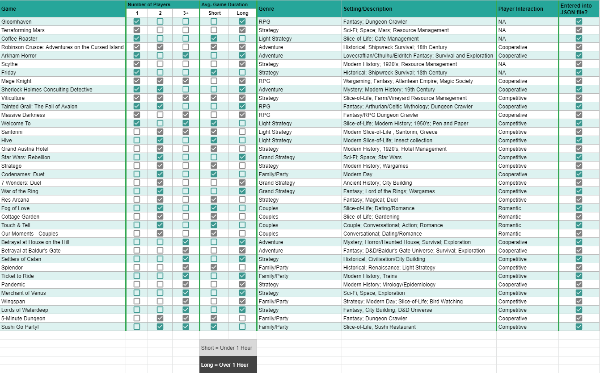
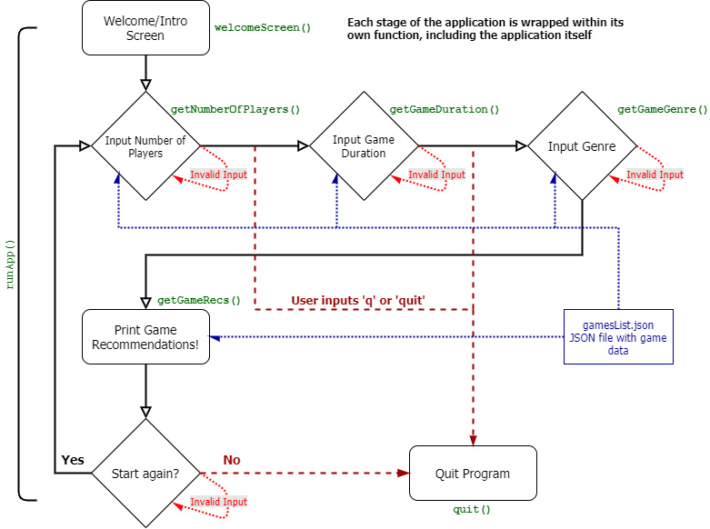
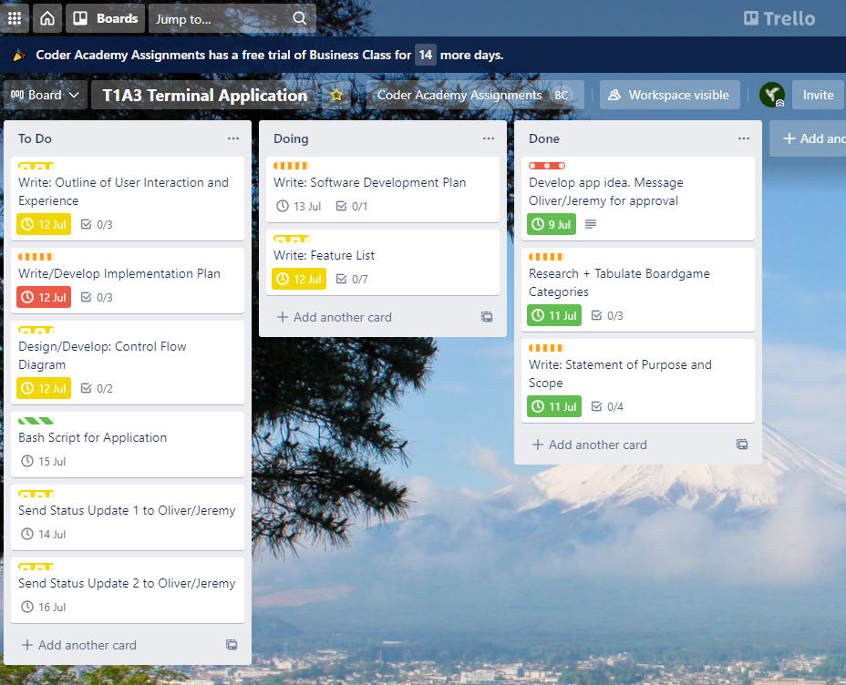

# Boardgame Picker
CCC-2021 T1A3 - Terminal Application - Karl Alberto

# Software Development Plan

## Purpose and Scope

### Problem Overview

This application is designed to give users suggestions for tabletop games to play, and features options for users to choose between single-player, two-player, and more than two player (party) games.

The last 18 months (as of development, July 2021) has seen more and more people take an interest in indoor activities out of necessity. And as a form of leisure away from TV screens, computer monitors, phones and tablets; board games, card games and other tabletop games have seen a massive boost in popularity.

The influence of video games over the last few decades has also bled into tabletop game development and the sheer variety of game types and genres now available makes it hard to dive into the hobby sometimes.

Even those well versed in tabletop games are sometimes so spoilt for choice these days that analysis-paralysis sets in when trying to decide on a game to play.

This application aims to ease that issue. The current list of games available is curated from a personal selection of popular titles, but there is scope to expand on this list in the future.

### Target Audience

Users of this app are either individuals looking for a tabletop game to spend their leisure time on (the single player option); or the "host" of a game night introducing another player (or players) to a game that the other parties might be interested in playing. Ideally, the host will have experience with most of the titles offered (or tabletop game conventions in general) as this helps in smoother set up of the titles, and delivers a more accurate representation of the average game duration.

### Application Use

The app works by asking the user questions that will filter down and help come up with suggestions for possible games to play. As mentioned previously, games can cater for different numbers of player groups. This feature will be open for further expansion in the future (for specific numbers of players, rather than the current range offered).

Questions will be gated and multiple choice for ease of use, so the application has less possible sources for user error.

## Features

### **Main Features**

### Branching Paths

Users will be able to choose between 3 different options for the number of people playing: single-player, two-player, or 3+ (party) player games. After that, users can choose the game duration - either 'Short' (under 1 hour) or 'Long' (over 1 hour). This will then lock out certain genre options in the subsequent question, which the narrows down the available game recommendations in the end.

### Multiple Choice

The options offered by the app will be multiple choice. As mentioned in sections prior, this will help guide users in making the correct syntactic options. Any incorrect inputs will trigger a loop (along with an associated error message) until the user chooses an available option.

### Dataset

The list of tabletop games will come from a separate dataset file, which the application can reference from. I have chosen to use `JSON` as it is a built-in Python package and very closely mimics elements of dictionaries and lists we have learned about in class thus far. Outside of adding new genres/categories of games, this will also allow for new titles to be added (to the JSON file) without altering the application code.

### Restart/Exit

At the end of the questions segment, users wil be given a list of games that will suit the requirements of the user. Afterwards, they will be given the option to exit the application, or to restart and go through the process again (for a different result).

*Spreadsheet of games to include in dataset:*

### **Additional Features**

Some additional features that can be implemented after core features run (with no errors):

* Additional error handling/prevention that will ensure the correct type of data is assigned to the program's variables, when user input is required.
* Include an "I'm Feeling Lucky" function that allows users to output a single, randomised game suggestion at the start of the program, skipping the questions.
* Add 'Player Interaction' field as another qualifier/filter, so that user/s can choose between competitive and cooperative styles of games ("NA" included for single-player games; "Romantic" included for _some_ two-player games).
* "Back Button"/Redo Last - to allow users to go back to the previous question.
* Clear terminal/full screen app display
* More Info - to display more details/short desciption about the games offered in results screen. (Example: "Learn more about [game title]")
* User added games - to give users the ability to add a tabletop game not currently included in the database; also allowing them to assign number of players, game duration, and genre.
* Display ASCII "loading results" animation prior to displaying results screen.

## User Interaction & Experience

### Introduction Screen

A short introduction screen will be displayed with a short explanation on what the program is about, and how to interact with it. There will be a step-by-step guide, and prompts for the audience at each level.

### Step-by-Step Interaction

Answers for questions are presented with simplified options to minimise user input error. Instead of asking for a string to be entered, multiple choice questions will only require a single digit input to advance the application, unless the user chooses to quit early. In this case, the user can type 'q' or 'quit' trigger a `quit()` *SystemExit* exception.

### Error Handling

Incorrect inputs will trigger a loop asking the user to redo their answer with an actionable input (or to exit the application). Error message will notify them of an incorrect/invalid input.

## Control Flow Diagram

Control Flow Diagram that illustrates how users will interact with the application and its features. A PDF version can also be found [here](./assets/control-flow-diagram-v2.pdf).

## Implementation Plan

Complete Implementation Plan can be found [here](./implementation-plan.md).

Here are some Trello Board screenshots as the project progressed (more screenshots and details in the document):

Project Start:

Update for 16/07/2021:

## Status Updates

Status updates can be found in the development log document [here](./development-log.md).

Included below are some key development milestones, with more details in the document.

### Update 1 - Wednesday, 14 July 2021

#### **Key Development Items**

* JSON file updated with list of all games to be included in application.
* Defined packages to import and key functions.
* Implemented user input function to capture number of players.

### Update 2 - Friday, 16 July 2021

#### **Key Development Items**

* Completed minimum viable product.
* Finished work on welcome screen.
* Added ASCII art on welcome screen.
* Finished work on 'Restart' option.
* Began testing program.
* Wrote Help file.

## Application Testing

Spreadsheets for testing can be found here: [T1A3 - Application Testing](https://docs.google.com/spreadsheets/d/1MtP1JEIxziC8FzLlZQdMe6uaXkr8M-RvtGlvbbMq3Fk/edit?usp=sharing)
